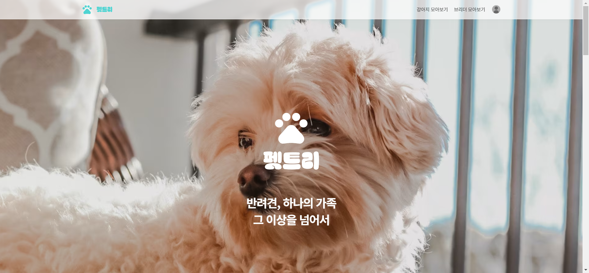

유기견 방지를 위한 입양 자격 검증 및 브리더 매칭 서비스 

## ⭐ 프로젝트 소개
---

- **Who’s Breeder?**
    
    **우수한 견종보존을 위해 동물보호 의식과 견종표준의 이해를 기반으로,**
    
    **견종의 짝짓기, 출산, 질병, 위생 자견분양 등 번식에 전문적인 지식을 갖추어**
    
    **강아지나 고양이의 혈통을 유지하고 올바르게 번식해 애견문화 발전에 기여**
    
-
    **Breeder와 Adopter(분양희망자)를 연결하여, 강아지를 분양받도록 도와주는 프로젝트**

### ⏰개발 기간

- 2023.04.17 ~ 2023.11.05

### 📎배포 사이트

- 펫트리

## 👤 팀원 소개
---
<table>
  <tbody>
    <tr>
      <td align="center"><a href="https://github.com/Suxxxxhyun"> <b>BE 팀장 : 박수현</b></a> </td>
      <td align="center"><a href="https://github.com/granen32"> <b>FE 부팀장 : 권규형</b></a> </td>
      <td align="center"><a href="https://github.com/ChanghyeonO"> <b>FE 팀원 : 오창현</b></a> </td>
      <td align="center"><a href="https://github.com/kjungit"> <b>FE 팀원 : 권범준</b></a> </td>
      <td align="center"><a href=""> <b>BE 팀원 : 이지수</b></a> </td>
      <td align="center"><a href=""> <b>디자이너 : 이수언</b></a> </td>
    </tr>
    <tr>
        <td>
            <ol>
                <li>데이터베이스 설계</li>
                <li>docker, CICD를 통한 ec2배포</li>
                <li>브리더 모아보기 거리순 정렬</li>
                <li>JWT로그인</li>
                <li>카카오Oauth</li>
                <li>강아지모아보기 다중검색</li>
                <li>견종검색</li>
                <li>기초지식테스트</li>
                <li>제3자가 보는 브리더프로필조회</li>
                <li>제3자가 보는 분양희망자프로필조회</li>
                <li>분양후기관리</li>
                <li>분양신청내역</li>
                <li>회원정보수정</li>
                <li>프로필관리</li>
                <li>회원가입</li>
                <li>회원탈퇴</li>
            </ol>
        </td>
        <td>
            <ol>
                <li>보유견종관리</li>
                <li>분양후기</li>
            </ol>
        </td>
        <td>
            <ol>
                <li>땡땡</li>
            </ol>
        </td>
        <td>
            <ol>
                <li>땡땡</li>
            </ol>
        </td>
        <td>
            <ol>
                <li>브리더 인증받기</li>
                <li>관리자 승인</li>
                <li>보유견종관리</li>
            </ol>
        </td>
        <td>
            <ol>
                <li>피그마를 통한 디자인</li>
                <li>시연영상</li>
            </ol>
        </td>
    </tr>
  </tbody>
</table>

## 💠 아키텍쳐 
---

## 🏷️ Frontend 폴더 구조
--- 
<pre>
    <code> 
    </code>
</pre>

