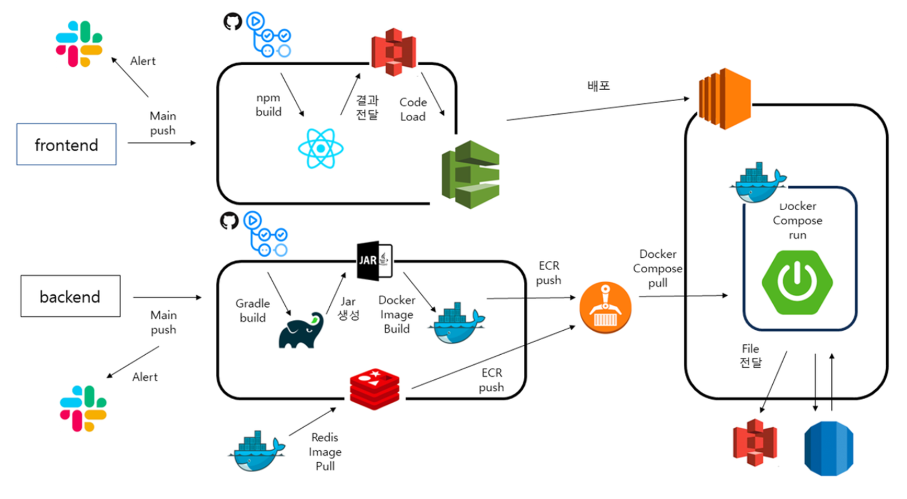

<br />
<br />

<div align="center">

<br />
<br />
</div>

<br />

## 📌 강아지 분양서비스 펫트리🐶

#### 프로젝트 기간 : 2023년 10월 ~ 진행중

### [🌎 웹사이트 바로가기](https://nextpetree.store/)

<br />

## 📌 서비스 소개

### 👥 페르소나

👩🏻이현지 (26세)

성별 : 여자

직업 : 직장인

“검증된 브리더에게 강아지를 입양받고 싶어요“

직장인 현지는 강아지를 입양받고 싶지만, 강아지를 분양 받는 과정이 너무 복잡하고, 또 모르는 브리더에게 강아지를 분양 받는 것이 걱정이 됩니다.

👦🏻김두식 (29세)

성별 : 남자

직업 : 전문 브리더

“기초 지식이 있는 사람들에게 강아지를 분양하고 싶어요“

전문 브리더 김두식씨는 강아지를 분양하길 원하지만, 혹시나 기초 지식도 없는 입양인에게 본인의 소중한 강아지가 입양될까 걱정이 됩니다.

<br />

<!-- ## 📌 시연 영상

### [▶️ 시연 영상 바로가기](https://www.youtube.com/watch?v=1TeH3DO5bOA) -->

## 📌 시스템 아키텍쳐



## 📌 기술 스택

| **Language** |

JavaScript, TypeScript

<!--
| **Backend** |

Node.js, Express.js, Mongoose-->

| **Frontend** |

React, StyledComponents, Redux-toolkit

| **Communication** |

Figma, Github, Slack

| **Release** |

Frontend : AWS S3, CloudFront, Route53
<br/>

<!--BackEnd:-->

<br>

## 📌 서비스 기능 명세

### 유저기능

1. 사용자는 회원가입시 브리더와 분양희망자를 선택할 수 있다.
2. 사용자는 회원가입시 이메일과 닉네임 중복 확인을 할 수 있다.
3. 사용자는 회원가입시 주력견종 선택을 할 수 있다.
4. 사용자는 회원가입시 활동지역을 검색할 수 있고, 휴대전화로 본인인증이 가능하다.
5. 사용자는 로그인시 일반 로그인, 카카오 로그인 선택이 가능하다.(최초 로그인 및 연동 필요)
6. 사용자는 인증 테스트를 통해 반려동물에 대한 기초지식 인증을 받을 수 있다.
7. 사용자는 강아지 모아보기를 통해 브리더가 등록한 강아지들을 확인할 수 있다.
8. 사용자는 강아지 모아보기를 통해 브리더가 등록한 강아지들을 예약할 수 있다.
9. 사용자는 강아지 모아보기를 통해 브리더가 등록한 강아지 중 분양 신청서를 작성할 수 있다.
10. 사용자는 강아지 모아보기에서 필터 및 검색 기능을 사용할 수 있다.
11. 사용자는 브리더 모아보기를 통해 등록된 브리더를 확인할 수 있다.
12. 사용자는 브리더 모아보기를 통해 인증된 브리더 필터 및 검색 기능을 사용할 수 있다.
13. 사용자는 브리더 모아보기 상세 기능을 통해 브리더에 대한 상세 정보를 확인할 수 있다.

### 분양 희망자 마이페이지 기능

1. 로그인 한 사용자는 분양신청 내역을 확인할 수 있다.
2. 로그인 한 사용자는 분양신청 내역 검색을 할 수 있다.
3. 로그인 한 사용자는 분양신청 승인 여부와 후기를 작성할 수 있다.
4. 로그인 한 사용자는 작성한 후기를 관리할 수 있다.
5. 로그인 한 사용자는 프로필 관리에서 주거환경 설정을 할 수 있다.

### 브리더 마이페이지 기능

1. 로그인 한 사용자는 분양신청 내역을 확인할 수 있다.
2. 로그인 한 사용자는 분양 신청 내역 검색을 할 수 있다.
3. 로그인 한 사용자는 분양신청 내역을 확인하고 승인 혹은 거절할 수 있다.
4. 로그인 한 사용자는 보유견종을 관리할 수 있다.
5. 로그인 한 사용자는 프로필 관리에서 주력견종 설정을 할 수 있다.

### 마이페이지 공통 기능

1. 로그인 한 사용자는 프로필 관리에서 이미지 수정과 자기소개를 작성할 수 있다.
2. 로그인 한 사용자는 회원정보 수정에서 이메일과 휴대전화, 닉네임, 활동지역을 수정할 수 있다.
3. 로그인 한 사용자는 비밀번호를 변경할 수 있다.(작성한 비밀번호 확인 가능)
4. 로그인 한 사용자는 로그아웃을 할 수 있다.
5. 로그인 한 사용자는 회원탈퇴를 할 수 있다.

<!-- ## 📌 디렉토리 파일구조 -->

<!-- <details><summary>Backend</summary>

```bash
📦backend

 ┣ 📂src
 ┃ ┣ 📂config
 ┃ ┃ ┣📜imgAPI 2.js
 ┃ ┃ ┣📜imgAPI.js
 ┃ ┃ ┣📜s3 2.js
 ┃ ┃ ┗📜s3.js
 ┃ ┣ 📂controller
 ┃ ┃ ┣📜chat_controller.js
 ┃ ┃ ┣📜comment_controller.js
 ┃ ┃ ┣📜friendChat_controller.js
 ┃ ┃ ┣📜friendMessage_controller.js
 ┃ ┃ ┣📜like_controller.js
 ┃ ┃ ┣📜mainhomeFriends_controller.js
 ┃ ┃ ┣📜mainhomeSecret_controller.js
 ┃ ┃ ┣📜message_controller.js
 ┃ ┃ ┣📜post_controller.js
 ┃ ┃ ┗📜user_controller.js
 ┃ ┣ 📂database/models
 ┃ ┃ ┣📜chat_model.js
 ┃ ┃ ┣📜comment_model.js
 ┃ ┃ ┣📜friendChat_model.js
 ┃ ┃ ┣📜friendMessage_model.js
 ┃ ┃ ┣📜index.js
 ┃ ┃ ┣📜like_model.js
 ┃ ┃ ┣📜mainhomeFriends_model.js
 ┃ ┃ ┣📜mainhomeSecret_model.js
 ┃ ┃ ┣📜message_model.js
 ┃ ┃ ┣📜post_model.js
 ┃ ┃ ┗📜user_model.js
 ┃ ┣ 📂lib
 ┃ ┃ ┣📜constant.js
 ┃ ┃ ┣📜socket.js
 ┃ ┃ ┗📜utils.js
 ┃ ┣ 📂middlewares
 ┃ ┃ ┣📜adminCheck.js
 ┃ ┃ ┣📜asyncHandler.js
 ┃ ┃ ┣📜index.js
 ┃ ┃ ┣📜login_required.js
 ┃ ┃ ┗📜registerMail.js
 ┃ ┣ 📂routers
 ┃ ┃ ┣📜chat_router.js
 ┃ ┃ ┣📜comment_router.js
 ┃ ┃ ┣📜like_router.js
 ┃ ┃ ┣📜mainhome_router.js
 ┃ ┃ ┣📜message_router.js
 ┃ ┃ ┣📜post_router.js
 ┃ ┃ ┗📜user_router.js
 ┃ ┣ 📂services
 ┃ ┃ ┣📜chat_service.js
 ┃ ┃ ┣📜comment_service.js
 ┃ ┃ ┣📜friendChat_service.js
 ┃ ┃ ┣📜friendMessage_service.js
 ┃ ┃ ┣📜like_service.js
 ┃ ┃ ┣📜mainhomeFriends_service.js
 ┃ ┃ ┣📜mainhomeSecret_service.js
 ┃ ┃ ┣📜message_service.js
 ┃ ┃ ┣📜post_service.js
 ┃ ┃ ┗📜user_service.js
 ┣ 📜.env
 ┣ 📜gitignore
 ┣ 📜package-lock.json
 ┣ 📜package-lock.json
 ┣ 📜package.json
``` -->

<!-- </details>
<details><summary>Frontend</summary>

```bash
📦frontend
 ┣ 📂public
 ┃ ┗ 📜index.html
 ┣ 📂src
 ┃ ┣ 📂api
 ┃ ┣ 📂assets
 ┃ ┃ ┣ 📂icons
 ┃ ┃ ┗ 📂images
 ┃ ┣ 📂components
 ┃ ┃ ┣ 📂AdminDetail
 ┃ ┃ ┃ ┣ 📂MemberDetail
 ┃ ┃ ┃ ┃ ┣ 📜MemberDetail.tsx
 ┃ ┃ ┃ ┃ ┗ 📜MemberDetailStyle.ts
 ┃ ┃ ┃ ┗ 📂ReportDetail
 ┃ ┃ ┃ ┃ ┣ 📜ReportDetail.tsx
 ┃ ┃ ┃ ┃ ┗ 📜ReportDetailStyle.ts
 ┃ ┃ ┣ 📂AdminHeader
 ┃ ┃ ┃ ┣ 📜AdminHeader.tsx
 ┃ ┃ ┃ ┗ 📜AdminHeaderStyle.ts
 ┃ ┃ ┣ 📂Buttons
 ┃ ┃ ┃ ┣ 📜DefaultButton.tsx
 ┃ ┃ ┃ ┗ 📜DefaultButtonStyle.ts
 ┃ ┃ ┣ 📂Chat
 ┃ ┃ ┃ ┣ 📜Chat.tsx
 ┃ ┃ ┃ ┣ 📜FriendChat.tsx
 ┃ ┃ ┃ ┗ 📜ChatStyle.ts
 ┃ ┃ ┣ 📂ChatBox
 ┃ ┃ ┃ ┣ 📜ChatBox.tsx
 ┃ ┃ ┃ ┣ 📜FriendChatBox.tsx
 ┃ ┃ ┃ ┗ 📜ChatBoxStyle.ts
 ┃ ┃ ┣ 📂DMList
 ┃ ┃ ┃ ┣ 📜DMList.tsx
 ┃ ┃ ┃ ┣ 📜FriendDMList.tsx
 ┃ ┃ ┃ ┗ 📜DMListStyle.ts
 ┃ ┃ ┣ 📂Footer
 ┃ ┃ ┃ ┣ 📜Footer.tsx
 ┃ ┃ ┃ ┗ 📜FooterStyle.ts
 ┃ ┃ ┣ 📂Header
 ┃ ┃ ┃ ┣ 📂DetailHeader
 ┃ ┃ ┃ ┃ ┣ 📜DetailHeader.tsx
 ┃ ┃ ┃ ┃ ┗ 📜DeatailHeaderStyle.ts
 ┃ ┃ ┃ ┣ 📜Header.tsx
 ┃ ┃ ┃ ┗ 📜HeaderStyle.ts
 ┃ ┃ ┣ 📂MainHomeContent
 ┃ ┃ ┃ ┣ 📂MainHomeContentDetail
 ┃ ┃ ┃ ┃ ┣ 📜MainHomeContentImage.tsx
 ┃ ┃ ┃ ┃ ┗ 📜MainHomeContentInnerContent.ts
 ┃ ┃ ┃ ┣ 📜MainHomeContent.tsx
 ┃ ┃ ┃ ┗ 📜MainHomeContentStyle.ts
 ┃ ┃ ┣ 📂MainHomeSendBox
 ┃ ┃ ┃ ┣ 📜MainHomeSendBox.tsx
 ┃ ┃ ┃ ┗ 📜MainHomeSendBoxStyle.ts
 ┃ ┃ ┣ 📂MessageBubble
 ┃ ┃ ┃ ┗ 📜MessageBubble.tsx
 ┃ ┃ ┣ 📂ProfileUpdateModal
 ┃ ┃ ┃ ┣ 📜arrow_back_icon.svg
 ┃ ┃ ┃ ┣ 📜media_icon.svg
 ┃ ┃ ┃ ┣ 📜ProfileUpdateModal.tsx
 ┃ ┃ ┃ ┗ 📜ProfileUpdateModalStyle.ts
 ┃ ┃ ┣ 📂SearchBar
 ┃ ┃ ┃ ┣ 📜SearchBar.tsx
 ┃ ┃ ┃ ┗ 📜SearchBarStyle.ts
 ┃ ┃ ┣ 📂SearchModal
 ┃ ┃ ┃ ┣ 📜SearchModal.tsx
 ┃ ┃ ┃ ┗ 📜SearchModalStyle.ts
 ┃ ┣ 📂hooks
 ┃ ┃ ┣ 📜useAutoScroll.ts
 ┃ ┃ ┣ 📜useMainHomePost.ts
 ┃ ┃ ┗ 📜useSocket.ts
 ┃ ┣ 📂pages
 ┃ ┃ ┣ 📂Admin
 ┃ ┃ ┃ ┣ 📂Main
 ┃ ┃ ┃ ┃ ┣ 📜AdminMain.tsx
 ┃ ┃ ┃ ┃ ┗ 📜AdminMainStyle.ts
 ┃ ┃ ┃ ┣ 📂ReportManagement
 ┃ ┃ ┃ ┃ ┣ 📜ReportManagement.tsx
 ┃ ┃ ┃ ┃ ┗ 📜ReportManagementStyle.ts
 ┃ ┃ ┃ ┗ 📂MemberManagement
 ┃ ┃ ┃ ┃ ┣ 📜MemberManagement.tsx
 ┃ ┃ ┃ ┃ ┗ 📜MemberManagementStyle.ts
 ┃ ┃ ┣ 📂Chatting
 ┃ ┃ ┃ ┣ 📜Chatting.tsx
 ┃ ┃ ┃ ┣ 📜FriendChatting.tsx
 ┃ ┃ ┃ ┗ 📜ChattingStyle.ts
 ┃ ┃ ┣ 📂Main
 ┃ ┃ ┃ ┣ 📜Main.tsx
 ┃ ┃ ┃ ┗ 📜MainStyle.ts
 ┃ ┃ ┣ 📂MainHome
 ┃ ┃ ┃ ┣ 📜MainHomeFriends.tsx
 ┃ ┃ ┃ ┣ 📜MainHomeSecret.tsx
 ┃ ┃ ┃ ┗ 📜MainHomeStyle.ts
 ┃ ┃ ┣ 📂UserAccount
 ┃ ┃ ┃ ┣ 📂Login
 ┃ ┃ ┃ ┃ ┣ 📜Login.tsx
 ┃ ┃ ┃ ┃ ┣ 📜Register.tsx
 ┃ ┃ ┃ ┃ ┗ 📜LoginStyle.ts
 ┃ ┃ ┃ ┣ 📂UserEdit
 ┃ ┃ ┃ ┃ ┣ 📜UserEdit.tsx
 ┃ ┃ ┃ ┃ ┗ 📜UserEditStyle.ts
 ┃ ┃ ┃ ┗ 📂UserWithdrawal
 ┃ ┃ ┃ ┃ ┗ 📜UserWithdrawal.tsx
 ┃ ┃ ┗ 📂UserMain
 ┃ ┃ ┃ ┣ 📂Detail
 ┃ ┃ ┃ ┃ ┣ 📜Detail.tsx
 ┃ ┃ ┃ ┃ ┗ 📜DetailStyle.ts
 ┃ ┃ ┃ ┗ 📂UploadPost
 ┃ ┃ ┃ ┃ ┣ 📜UploadPost.tsx
 ┃ ┃ ┃ ┃ ┗ 📜UploadPostStyle.ts
 ┃ ┃ ┃ ┣ 📜UserMain.tsx
 ┃ ┃ ┃ ┗ 📜UserMainStyle.ts
 ┃ ┣ 📂styles
 ┃ ┃ ┣ 📜GlobalFont.ts
 ┃ ┃ ┣ 📜GlolbalStyles.ts
 ┃ ┃ ┣ 📜Styled.d.ts
 ┃ ┃ ┗ 📜Theme.ts
 ┃ ┣ 📂types
 ┃ ┃ ┣ 📜chatType.ts
 ┃ ┃ ┣ 📜dataType.ts
 ┃ ┃ ┗ 📜postType.ts
 ┃ ┣ 📂utils
 ┃ ┣ 📜App.tsx
 ┃ ┣ 📜index.tsx
 ┣ 📜.env
 ┣ 📜.gitignore
 ┣ 📜.prettierrc
 ┣ 📜package-lock.json
 ┣ 📜package.json
 ┗ 📜tsconfig.json
```

</details>

<br> -->

## 📌 실행 방법

1. 레포지토리를 클론하고자 하는 디렉토리에서 아래 명령어를 수행

```bash
git clone <레포지토리 주소>
```

2. 클론한 디렉토리에서 frontend, backend디렉토리로 들어가 아래 명령어를 통해 각각각 필요한 module 설치

```bash
npm install
```

<!-- 3. backend에서 필요한 `.env` 설정

```bash
PORT=<포트번호>
MONGODB_URI=<몽고db url>
ACCESS_SECRET_KEY=<key>
REFRESH_SECRET_KEY=<key>
S3_ACCESS_KEY=<key>
S3_SECRET_ACCESS_KEY=<key>
S3_REGION=<key>
S3_BUCKET_NAME=<key>
``` -->

4. frontend에서 필요한 `.env` 설정

```bash
REACT_APP_API_URL=<백엔드url>
```

4. express 앱과 react앱을 실행

```bash
npm run start
```

<br>

## 📌 프론트엔드 팀 구성원

<table width="600">
    <thead>
    </thead>
    <tbody>
    <tr>
        <th>이름</th>
        <td width="100" align="center">오창현</td>
        <td width="100" align="center">김민준</td>
        <td width="100" align="center">김용현</td>
    </tr>
    <tr>
        <th>역할</th>
        <td width="150" align="center">
            로그인, 회원가입&탈퇴, <br>분양신청내역
        </td>
        <td width="150" align="center">
            강아지, 브리더 모아보기<br>
            프로필관리, 회원정보 수정
        </td>
        <td width="150" align="center">
            강아지, 브리더 모아보기<br> 상세
        </td>
    </tr>
    <tr>
    </tbody>
</table>

<br>
<br>
